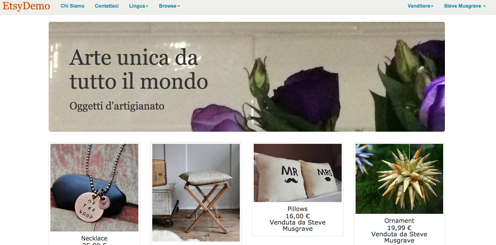

# Etsydemo - an Etsy clone
A project to develop a clone of Yelp following a [BaseRails] course.



## Learning Objectives
- To consolidate and extend my Ruby on Rails skills

## How to run it
```sh
git clone git@github.com:StephanMusgrave/Etysdemo-musgrave.git
cd etsydemo
rails s

```

Heroku
----
Click here to open the web page on Heroku: [App on Heroku]

## Technologies used

|Technology                 |Used for                        |
|---------------------------|--------------------------------|
|Ruby 2.1.2                 |Main programming language       |
|Ruby on Rails 4.1.1        |Model View Controller Framework |
|Heroku                     |Deployment: [App on Heroku]     |
|Sqlite3                    |SQL Database for development    |
|Postgrsql                  |SQL Database for deployment     |
|Devise                     |Enabling users and admins       |
|Dropbox                    |Bulk image hosting              |
|Paperclip                  |A file attachment library for Active Record, used for uploading images|
|paperclip-dropbox          |extends Paperclip with Dropbox storage|
|Figaro                     |handling passwords and keys     |
|HTML5                      |Web Pages                       |
|CSS3                       |Styling                         |
|Bootstrap                  |Base styling theme              |
|Glypicons                  |for styling links and buttons   |
|Javascript                 |animations for alerts and checking payment forms |
|Stripe                     |credit card payments by buyers and transfer to seller bank account  |
|Rails Internationalization (I18n) API |for tranlation from US English to Italian and GB English |


## Developed by

[Steve Musgrave]

## Further work to do

[Steve Musgrave]:https://github.com/StephanMusgrave
[App on Heroku]:http://etsydemo-musgrave.herokuapp.com/
[BaseRails]:https://www.baserails.com/
